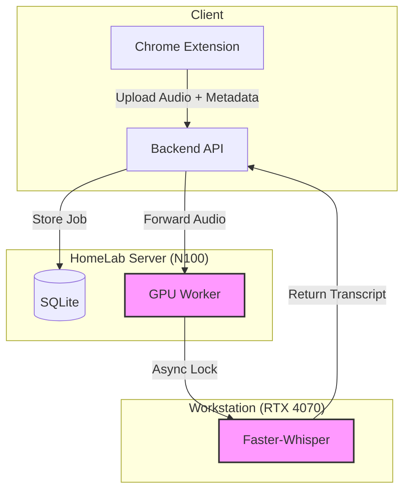

# MeetScribe 🎙️

**Automated Meeting Intelligence System** using Local LLMs & Whisper.

## 🚀 Vision
MeetScribe automatically records, transcribes, and analyzes video conferences (Google Meet, Zoom, Teams) completely **offline** and **locally**, ensuring 100% data privacy.
Designed for a distributed home-lab architecture: lightweight orchestration (N100) + heavy ML workloads (GPU).

## 🏗️ Architecture

The system is built on a **Split-Architecture** to optimize for hardware constraints and 24/7 availability.



1.  **Orchestrator Backend (FastAPI)**:
    *   Runs on low-power hardware (N100).
    *   Manages API requests, Database state, and Business Logic.
    *   Implements **Clean Architecture** (Repository/Service Pattern).
2.  **ML Worker (GPU/CUDA)**:
    *   Runs on high-end hardware (RTX 4070).
    *   Exposes a stateless API for heavy lifting (Transcription/Diarization).
    *   Powered by `faster-whisper` (CTranslate2) for 4x speedup vs vanilla Whisper.
    *   Protected by **Async Locks** and ThreadPools to prevent OOM.
3.  **Chrome Extension (Manifest V3)**:
    *   Captures high-quality audio streams (System Tab + Local Mic).
    *   No cloud dependency.

## 🛠️ Tech Stack

*   **Language**: Python 3.14
*   **Framework**: FastAPI (Async Native)
*   **Data Layer**: SQLModel (SQLAlchemy + Pydantic)
*   **Database**: SQLite (Async/aiosqlite)
*   **ML Engine**: Faster-Whisper, CTranslate2
*   **Concurrency**: Asyncio, ThreadPoolExecutor
*   **DevOps**: Docker ready, modular service design


## 📦 Installation & Usage

### 1. Backend (Orchestrator)
```bash
cd backend
uv sync
uv run uvicorn app.main:app --port 8000
```

### 2. GPU Worker
```bash
cd gpu-worker
# Ensure CUDA drivers are installed
uv sync
uv run worker_server.py --port 8001 --device cuda
```

### 3. Running Tests
```bash
# Integration test (requires backend running)
uv run pytest tests/integration_test.py

# Worker Concurrency test
uv run pytest tests/worker_concurrency_test.py
```
