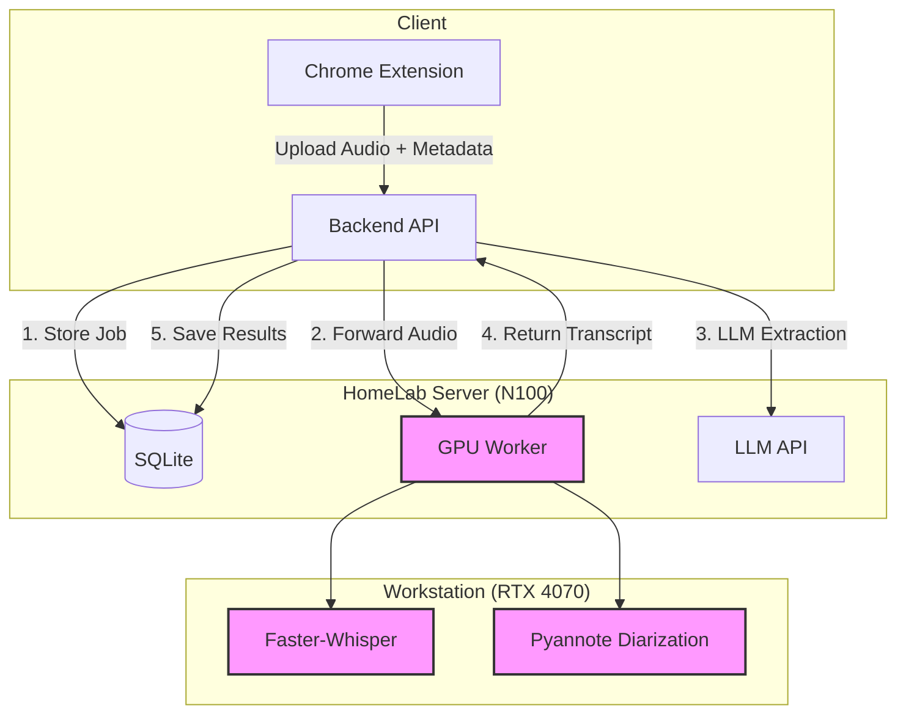

# MeetScribe 🎙️

**Automated Meeting Intelligence System** using LLMs & Whisper.

Self-hosted, privacy-first meeting transcription with speaker diarization, AI-powered summaries, and a full-featured Chrome extension dashboard.

## ✨ Features

- **Automatic Transcription** — Faster-Whisper (large-v3) with GPU acceleration
- **Speaker Diarization** — Pyannote identifies who speaks when (multi-speaker support)
- **LLM-Powered Analysis** — Automatic summary, action items, key decisions, and topic extraction
- **Audio Playback Sync** — Built-in player with transcript highlighting and click-to-seek
- **Dual-Track Recording** — Separate mic + tab capture for clean speaker separation
- **Inline Editing** — Edit transcript text, rename speakers, update meeting titles directly in the dashboard
- **Search & Filter** — Find meetings by title or platform
- **Export** — Copy to clipboard or export as `.txt`
- **Secure Access** — Bearer token auth, Tailscale-friendly (no public IP)
- **Smart Power Management** — Optional Tuya smart plug integration to wake GPU on demand

## 🏗️ Architecture

Split-architecture optimized for hardware constraints and 24/7 availability.



| Component | Role | Hardware |
|-----------|------|----------|
| **Backend API** (FastAPI) | Orchestration, storage, auth, LLM extraction | N100 (low-power, 24/7) |
| **GPU Worker** | Whisper transcription + Pyannote diarization | RTX 4070 (on-demand) |
| **Chrome Extension** | Audio capture, dashboard UI | Client browser |

## 🛠️ Tech Stack

| Layer | Technology |
|-------|-----------|
| **Backend** | Python 3.14, FastAPI, SQLModel, SQLite |
| **ML / Transcription** | Faster-Whisper (large-v3), CUDA |
| **Speaker Diarization** | Pyannote Audio 3.1 |
| **LLM Extraction** | Configurable LLM API (summary, actions, decisions) |
| **Frontend** | Chrome Extension (Manifest V3), vanilla JS |
| **Infrastructure** | Docker, async Python, Tailscale |

## 📦 Installation & Usage

### 1. Backend (Orchestrator)
```bash
cd backend
uv sync
uv run uvicorn app.main:app --port 8000
```

**Environment variables:**
```env
MEETSCRIBE_API_TOKEN=your-secret-token
MEETSCRIBE_GPU_HOST=gpu-machine-ip
MEETSCRIBE_SPEAKER_NAME=YourName
MEETSCRIBE_LOG_FILE=/var/log/meetscribe/backend.jsonl  # optional JSON log file (rotating)
LLM_API_KEY=your-llm-api-key        # For summary/action extraction
LLM_BASE_URL=https://your-llm-endpoint
MEETSCRIBE_EXTRACTION_PROMPT_VERSION=v1

# Optional: Langfuse (LLM observability only)
LANGFUSE_PUBLIC_KEY=pk-lf-...
LANGFUSE_SECRET_KEY=sk-lf-...
LANGFUSE_HOST=https://cloud.langfuse.com
MEETSCRIBE_LANGFUSE_CAPTURE_INPUT=false
MEETSCRIBE_LANGFUSE_CAPTURE_OUTPUT=false
```

Install the optional SDK to enable Langfuse export:
```bash
uv add langfuse
```

Console logs are always text-formatted for readability. Set `MEETSCRIBE_LOG_FILE` to also write
JSON structured logs to disk (with rotation).

`X-Request-ID` is supported on backend API calls. If provided by the client, it is echoed back in
the response, propagated to worker calls/logs, and included in LLM extraction observability metadata.

### 2. GPU Worker
```bash
cd gpu-worker
# Ensure CUDA drivers are installed
uv sync
uv run worker_server.py --port 8001 --device cuda
```

**Optional — Speaker Diarization:**
```env
HF_TOKEN=hf_xxx  # HuggingFace token (accept pyannote licenses first)
```

### 3. Chrome Extension
1. Open `chrome://extensions/`
2. Enable Developer Mode
3. Load unpacked → select `chrome-extension/`
4. Configure API URL and token in the extension settings

### 4. Running Tests
```bash
uv run pytest tests/integration_test.py
uv run pytest tests/worker_concurrency_test.py
```

## 📐 Project Structure

```
meetscribe/
├── backend/app/
│   ├── main.py                 # FastAPI endpoints
│   ├── config.py               # Environment-based config
│   ├── models.py               # SQLModel schema
│   ├── database.py             # SQLite + auto-migrations
│   ├── gpu_client.py           # GPU worker communication
│   ├── repositories/           # Data access layer
│   └── services/               # Business logic (meeting, extraction)
├── gpu-worker/
│   ├── worker_server.py        # HTTP server for transcription jobs
│   └── core/
│       ├── pipeline.py         # Transcription + diarization pipeline
│       ├── transcriber.py      # Faster-Whisper wrapper
│       └── diarizer.py         # Pyannote speaker diarization
├── chrome-extension/
│   └── src/
│       ├── main.html           # Dashboard UI
│       ├── main.js             # App logic (player, tabs, editing)
│       ├── main.css            # Dark theme styles
│       ├── popup.html          # Extension popup (capture controls)
│       └── background.js       # Audio capture service worker
└── infra/server/
    └── docker-compose.yml      # Deployment config
```

## ⚖️ Licensing

MeetScribe uses a dual-licensing model:

- **AGPL-3.0 (Community)**: default license for this repository (see `LICENSE`)
- **Commercial license**: available for closed-source/proprietary use (see `COMMERCIAL_LICENSE.md`)

If you do not have a signed commercial agreement, your use is governed by `LICENSE` (AGPL-3.0).
